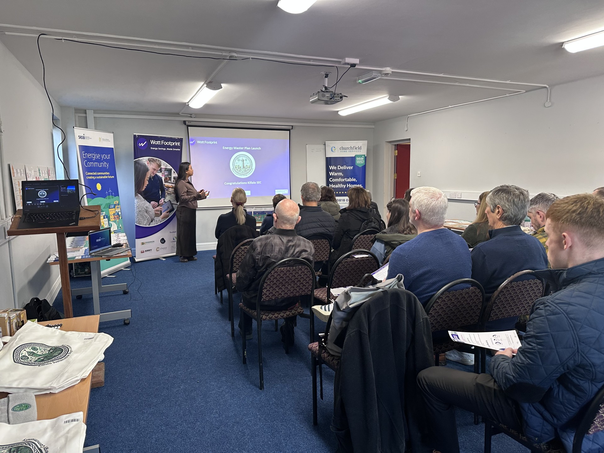
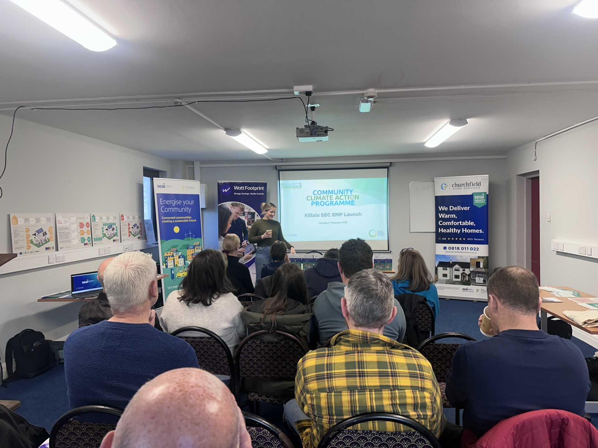
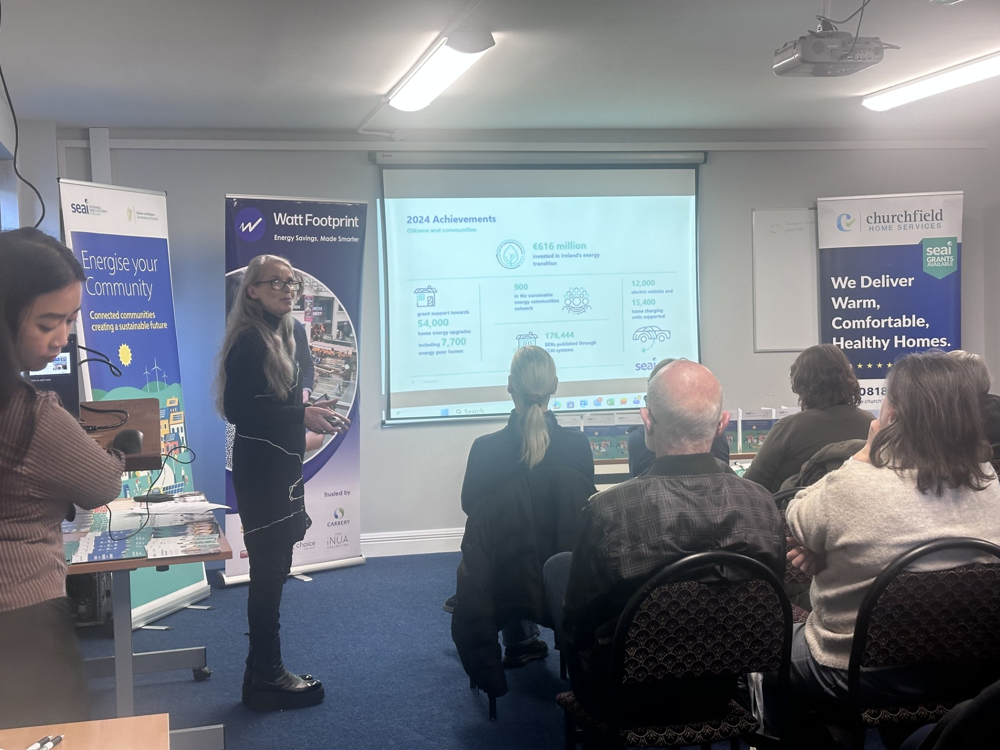

# Community Energy & Local Action

The Killala Sustainable Energy Community (SEC) brings together residents, schools, and local businesses to explore how our town can transition toward a cleaner, more affordable energy future.  
We’re part of the national SEC Network supported by the **Sustainable Energy Authority of Ireland (SEAI)**, and our focus is simple — **to make local energy work for local people.**

---

## ⚡ Current Focus Areas

- **Killala Energy Master Plan (EMP):** Developing a roadmap to reduce local emissions and improve building efficiency across homes, community buildings, and the Killala Business Park.

## 📸 Community in Action

  
  
  

<em>Snapshots from the Energy Master Plan launch, community flyers, and summary materials.</em>

---

### 📄 Download the 4-Pager

You can read or download the summary report below:

[📥 Download the Killala Energy Master Plan 4-Pager (PDF)](/assets/img/Killala%204%20Pager.pdf)

  
  
  

<em>Killala's Energy Master Plan Presentation 1st of November 2025.</em>

---
- **Awareness & Engagement:** Hosting workshops, school visits, and local radio spots to help people understand energy grants, home retrofits, and renewable technologies.  
- **Community Solar:** Exploring shared solar projects that could generate long-term savings and resilience for Killala.  
- **District Heating & Business Park Collaboration:** Assessing opportunities to harness existing industrial heat for community benefit.

---

## 🧩 Get Involved

- Join our [Killala SEC Facebook Group](https://www.facebook.com/groups/188355576826854)  
- Attend our community workshops — details are shared regularly on Facebook and local media  
- Volunteer or share your ideas for energy savings in the area  
- Email **killalasec@gmail.com** if you’d like to help with future events or local outreach

---

## 🌱 Why It Matters

Community energy isn’t just about renewables — it’s about **keeping value in our local economy**, **building skills**, and **creating fair access to affordable energy**.  
By working together, we can ensure that future investments in Killala directly benefit the people who live and work here.

---

*Supported by the Sustainable Energy Authority of Ireland, Mayo County Council, and Community Foundation Ireland.*
